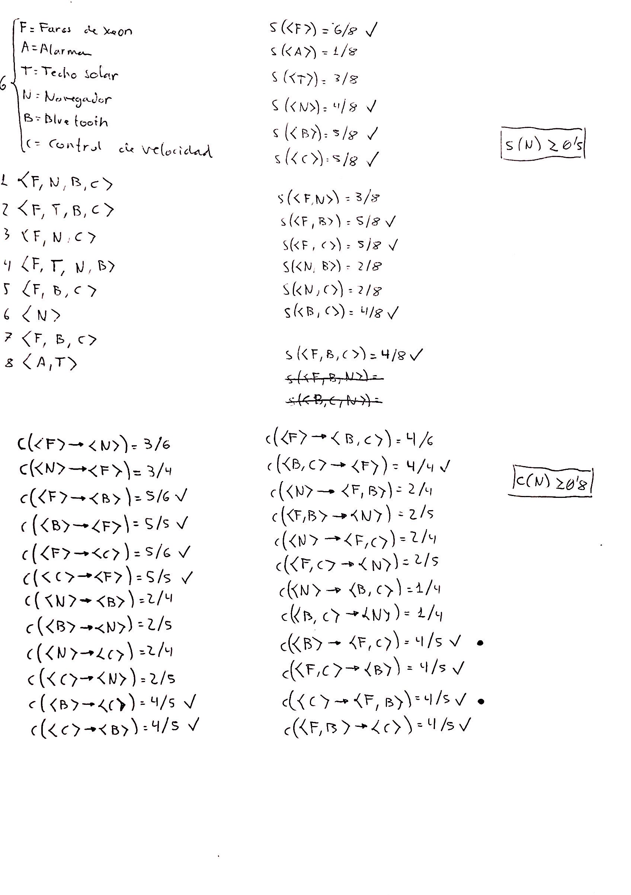

# Datos

|Faros_de_Xenon |Alarma |Techo_Solar|Navegador|Bluetooth|Control_de_Velocidad|
|---------------|-------|-----------|---------|---------|--------------------|
|1              |0      |0          |1        |1        |1                   |
|1              |0      |1          |0        |1        |1                   |
|1              |0      |0          |1        |0        |1                   |
|1              |0      |1          |1        |1        |0                   |
|1              |0      |0          |0        |1        |1                   |
|0              |0      |0          |1        |0        |0                   |
|1              |0      |0          |0        |1        |1                   |
|0              |1      |1          |0        |0        |0                   |

Soporte >= 0.5
Confianza >= 0.8

# Resultados obtenidos

```(txt)
[OK] {Control_de_Velocidad} => {Bluetooth}
[OK] {Bluetooth} => {Control_de_Velocidad}
[OK] {Control_de_Velocidad}=> {Faros_de_Xenon}
[OK] {Faros_de_Xenon}=> {Control_de_Velocidad}
[OK] {Bluetooth}=> {Faros_de_Xenon}
[OK] {Faros_de_Xenon}=> {Bluetooth}
[OK] {Bluetooth,Control_de_Velocidad} => {Faros_de_Xenon}
[OK] {Faros_de_Xenon,Control_de_Velocidad} => {Bluetooth}
[OK] {Faros_de_Xenon,Bluetooth} => {Control_de_Velocidad}

[NO] {Control_de_Velocidad} =>{Faros_de_Xenon,Bluetooth}
[NO] {Bluetooth} =>{Faros_de_Xenon,Control_de_Velocidad}
```

Los datos con [OK] fueron obtenidos por apriori, por mi implementación y a mano, los datos con NO solo por mi implementación y a mano.



# Replicar resultados

```(R)
source("calapriori.R")
source("f_apriori.R")
toTable(f_apriori(readAprioriFile("datos2.txt"),0.5,0.8))
calapriori(readAprioriFile("datos2.txt"),0.5,0.8)
```